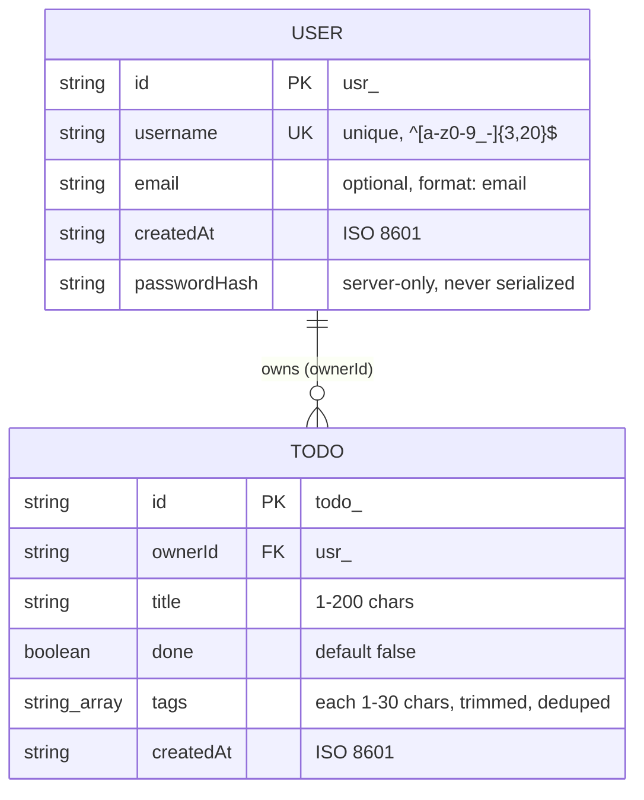

# Data models

**Audience:** developers (and coding agents) extending the app.
**Source of truth:** the TypeScript types in `packages/shared/src/` — this document explains
them; when it disagrees with the code, the code wins and this file needs a fix.



## User

| field | type | rules |
|---|---|---|
| `id` | `string` | `usr_` + `crypto.randomUUID()`, assigned at signup, immutable |
| `username` | `string` | unique (case-sensitive), `USERNAME_PATTERN` = `^[a-z0-9_-]{3,20}$` |
| `email` | `string?` | optional, ajv `format: "email"`; never verified |
| `createdAt` | `string` | ISO 8601, set at signup |

- **Public type:** `User` in `packages/shared/src/users.ts` — what the API returns and the
  web/CLI consume.
- **Stored record:** `UserRecord = User & { passwordHash }` in
  `packages/server/src/auth/routes.ts`. The hash has the format
  `scrypt:<salt hex 16B>:<key hex 32B>` (see `lib/password.ts`) and **must never appear in a
  response** — response schemas whitelist fields, and tests assert no leak.
- **Validation rules** live twice by design: shared functions (`validateUsername`,
  `validatePassword`, `PASSWORD_MIN_LENGTH` = 8) give the web instant feedback; the server's
  ajv route schemas enforce the same rules at the trust boundary.
- Uniqueness of `username` is checked at signup (409 on conflict) by scanning the store —
  O(n), fine at demo scale.

## Todo

| field | type | rules |
|---|---|---|
| `id` | `string` | `todo_` + `crypto.randomUUID()`, immutable |
| `ownerId` | `string` | the owning user's `id`; set from the JWT at creation, immutable |
| `title` | `string` | 1–200 chars |
| `done` | `boolean` | defaults to `false` |
| `tags` | `string[]` | each 1–30 chars; `normalizeTags` trims, drops empties, dedupes (first-seen order) on every write |
| `createdAt` | `string` | ISO 8601; lists are sorted by it |

- Type: `Todo` in `packages/shared/src/todos.ts`; stored as-is (no private fields).
- **Owner scoping is absolute:** every handler resolves todos through the caller's
  `ownerId`; another user's todo answers `404` (not `403`), so ids don't leak across
  accounts.
- `TodoFilter` (`{ tag?, done? }`) + `matchesTodoFilter` define the one filter semantic used
  by both the web's tag chips and the CLI's `--tag/--done/--open`.
- Deleting a user via the CLI (`asimov remove-user`) cascades to all their todos.

## JWT payload

Declared in `packages/server/src/types/fastify-jwt.d.ts`:

| claim | meaning |
|---|---|
| `sub` | `User.id` — handlers read `request.user.sub` |
| `username` | convenience copy; display only, not re-verified |
| `iat` / `exp` | set by `@fastify/jwt`; lifetime = `TOKEN_TTL` (default `7d`) |

Tokens are signed with `JWT_SECRET`. There is no revocation list — logout is client-side
(the web drops the token from `sessionStorage`). The token is the only client-side state;
it lives in `sessionStorage`, which is per-tab.

## API envelopes

From `packages/shared/src/api.ts`, used by the server's handlers/error handler and the web's
fetch wrapper:

- **Success:** `Envelope<T>` = `{ "data": … }`. Examples: `{data: {user, token}}` (auth),
  `{data: {todo}}`, `{data: {todos}}`.
- **Error:** `ProblemBody` — RFC 7807 `application/problem+json` with `type`, `title`,
  `status`, `detail`, `instance` (all optional per spec; the server always sets the first
  three plus `instance`). Produced centrally by `packages/server/src/lib/problem.ts`.

## On-disk storage

`createStore` (`packages/server/src/lib/store.ts`) persists each collection as **one JSON
file**: an object keyed by record id.

```
<workspace root>/data/
  users.json   { "<usr_id>": UserRecord, ... }
  todos.json   { "<todo_id>": Todo, ... }
```

- Loaded fully into an in-memory `Map` at startup; every mutation rewrites the whole file
  via tmp-file + `rename` (atomic on POSIX). Single-process by design — external edits are
  invisible until restart, which is why the CLI warns to stop the server before
  `remove-user`.
- Location precedence: `DATA_DIR` env > root package.json `"config": {"dataDir"}` >
  `<workspace root>/data` (resolver: `packages/server/src/lib/workspace.ts`, shared by
  server and CLI).
- Untracked by design; `git add -f` a file for an ad hoc snapshot — never with real
  accounts, since `users.json` contains password hashes.
- Known seam: one file per **collection** is right at this scale; one file per **record**
  (asimov-happy's layout) is the natural evolution if collections grow.

## Server configuration (not persisted)

`AppConfig` in `packages/server/src/config.ts`: `port`, `host`, `jwtSecret`, `tokenTtl`,
`dataDir`, `webDist`, `logger` — built from env by `envConfig()`, injected into
`buildApp(config)`. Tests construct it directly (`test-helpers.ts`), which is how they get
temp data dirs and short token TTLs.
